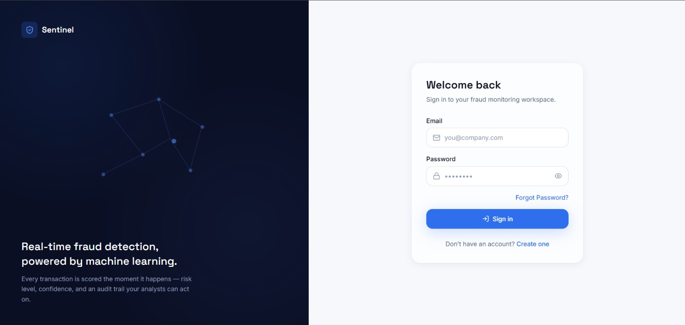

# Sentinel — AI-Powered Financial Fraud Detection System

A full-stack fraud detection platform that combines a React frontend, Spring Boot backend, MongoDB persistence, Razorpay test-payment integration, and a Python/FastAPI machine-learning service.

## Architecture

```text
React + Vite + Tailwind CSS
            |
            v
     Spring Boot REST API
       /           \
      v             v
   MongoDB       FastAPI ML Service
                     |
                     v
              XGBoost Pipeline
```

The frontend communicates with the Spring Boot API. The backend orchestrates transaction processing, persistence, fraud prediction, risk classification, alerts, feedback, and payment workflows. The Python service exposes the ML prediction endpoint and does not access MongoDB directly.

## 📸 Screenshots

### Login



### User Dashboard


### AI Fraud Simulator


### Admin Analytics Dashboard


### Fraud Monitoring Dashboard


## Tech Stack

| Layer | Technologies |
|---|---|
| Frontend | React, Vite, Tailwind CSS, Axios, Recharts |
| Backend | Java 21, Spring Boot, Spring Data MongoDB, WebClient, OpenAPI/Swagger |
| Database | MongoDB |
| ML Service | Python 3.11, FastAPI, scikit-learn, XGBoost, pandas |
| Payments | Razorpay test API |
| DevOps | Docker / Docker Compose |

## Main Features

- User registration and role-based portals
- Transaction submission and fraud prediction
- Fraud-risk classification and alert management
- Transaction history and prediction views
- Admin dashboards and analytics
- Fraud simulation workflow
- Razorpay test-payment order and verification flow
- REST API documentation with Swagger/OpenAPI
- Separate ML microservice with health and prediction endpoints
- Automated tests for the ML service

## Project Structure

```text
sentinel-fraud-detection/
├── backend/       # Spring Boot REST API
├── frontend/      # React + Vite web application
├── ml-service/    # FastAPI + XGBoost prediction service
├── .gitignore
└── README.md
```

## Prerequisites

- Java 21
- Maven 3.9+
- Node.js 18+
- Python 3.11
- MongoDB
- Docker Desktop (optional)

## Configuration

Real credentials are intentionally excluded from Git. Copy the example environment files and provide your own values locally.

### Backend

```bash
cd backend
cp .env.example .env
```

Set at least:

```text
RAZORPAY_KEY_ID=your_razorpay_key_id
RAZORPAY_KEY_SECRET=your_razorpay_key_secret
```

On Windows PowerShell, use `$env:NAME="value"` or configure the variables in your IDE instead of committing a `.env` file.

### Frontend

```bash
cd frontend
cp .env.example .env
```

The default local API URL is:

```text
VITE_API_BASE_URL=http://localhost:8080/api/v1
```

### ML Service

```bash
cd ml-service
cp .env.example .env
```

The repository includes the trained pipeline artifact required by the ML service.

## Running Locally

### 1. Start MongoDB

Make sure MongoDB is running locally and use the connection string configured for the selected Spring profile.

### 2. Start the ML service

```bash
cd ml-service
python -m venv .venv
```

Windows:

```powershell
.venv\Scripts\activate
```

Linux/macOS:

```bash
source .venv/bin/activate
```

Then:

```bash
pip install -r requirements.txt
uvicorn app.main:app --reload --host 0.0.0.0 --port 8000
```

### 3. Start the backend

```bash
cd backend
mvn spring-boot:run -Dspring-boot.run.profiles=dev
```

Backend API: `http://localhost:8080`

Swagger UI: `http://localhost:8080/swagger-ui/index.html`

### 4. Start the frontend

```bash
cd frontend
npm install
npm run dev
```

Frontend: `http://localhost:5173`

## ML API

Health check:

```http
GET /health
```

Prediction:

```http
POST /predict
Content-Type: application/json
```

The ML service performs the model-specific feature engineering and returns a fraud prediction, fraud probability, and model version. Business-level risk classification and alert creation remain in the Spring Boot backend.

## Testing

### ML service

```bash
cd ml-service
pytest
```

### Backend

```bash
cd backend
mvn test
```

## Security Notes

- Never commit `.env` files or API credentials.
- Use Razorpay test credentials for local development.
- The ML service should remain an internal service rather than being exposed directly to the public internet.
- Authentication/JWT security is an area for further production hardening in the current codebase.

## Current Development Notes

This is a portfolio/development project. Some production-hardening items remain, particularly complete authentication/security and deployment configuration. The repository is structured so those concerns can be extended without coupling the frontend directly to the ML service or database.

## Author

**Ritik Sahu**
